# Odín: el asistente total

Repositorio del Trabajo de Fin de Grado de Enrique de Vicente-Tutor Castillo.

Odín es un asistente personal local-first, autoalojado y proactivo. El objetivo del repositorio es reunir la memoria en LaTeX y, progresivamente, la documentación técnica, configuraciones y despliegues del ecosistema.

## Vista rápida

Odín integra conversación, domótica, memoria personal, videovigilancia, recetas, salud, monitorización del servidor y copias de seguridad en un único entorno autoalojado.

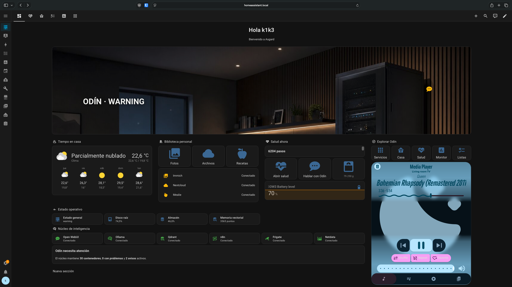

## Qué puede hacer

### Control y visión del hogar

El panel de Home Assistant centraliza cámaras, presencia, aspirador, móviles, televisión, sensores y consumo eléctrico.

| Casa | Consumo |
| --- | --- |
| 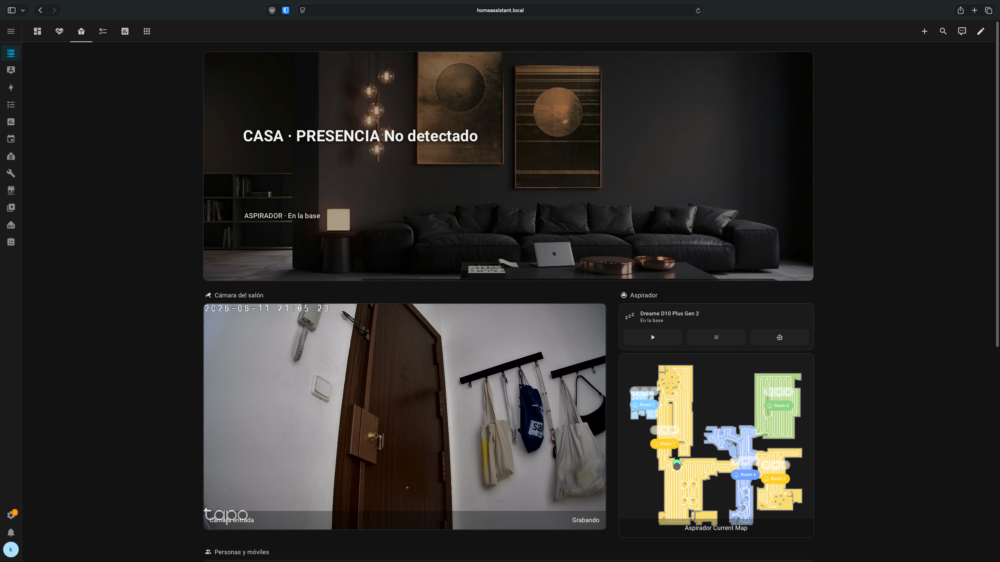 | 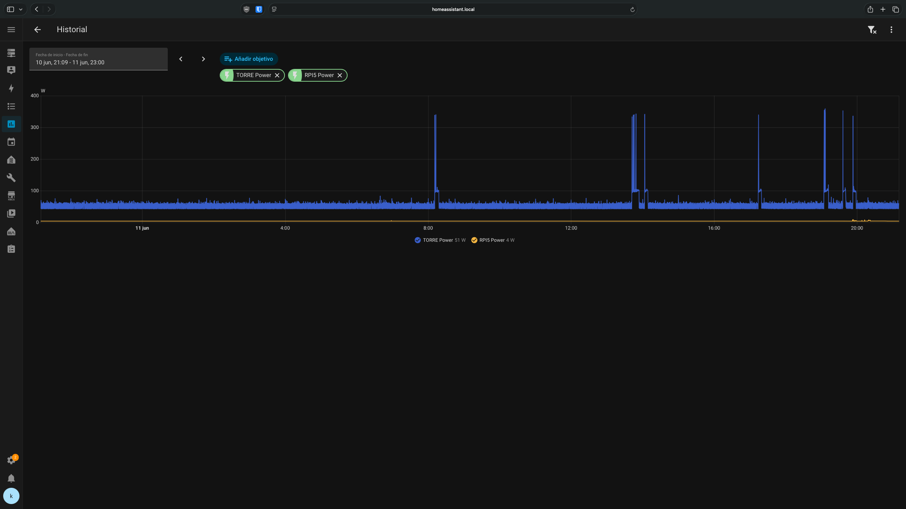 |

### Conversación con herramientas

Open WebUI actúa como interfaz conversacional. Desde el chat, Odín puede usar herramientas para buscar fotos en Immich, consultar cámaras de Frigate, guardar notas, crear recetas, consultar Nextcloud, revisar el sistema o interactuar con Home Assistant.

| Recuerdos visuales | Videovigilancia |
| --- | --- |
| 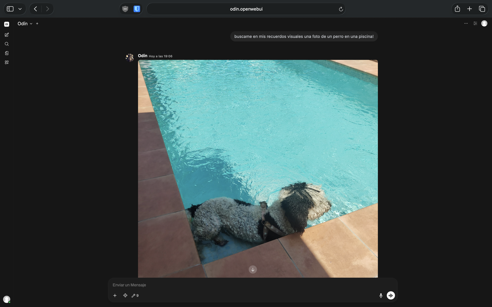 | 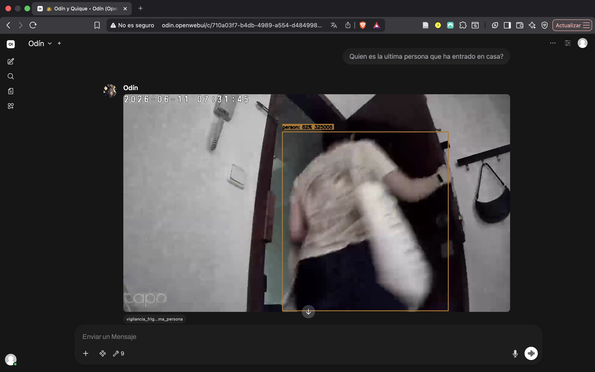 |

| Memoria personal | Herramientas disponibles |
| --- | --- |
| 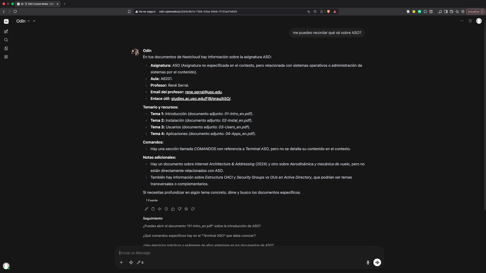 | 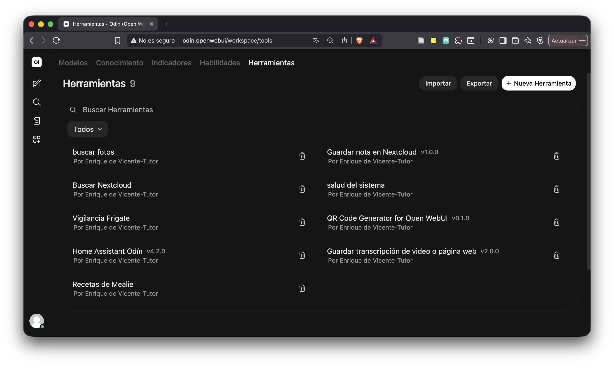 |

### Servicios personales

El sistema incluye biblioteca documental, fotografías, recetas, automatización, STT/TTS, monitorización y herramientas propias.

| Servicios | Recetas |
| --- | --- |
| 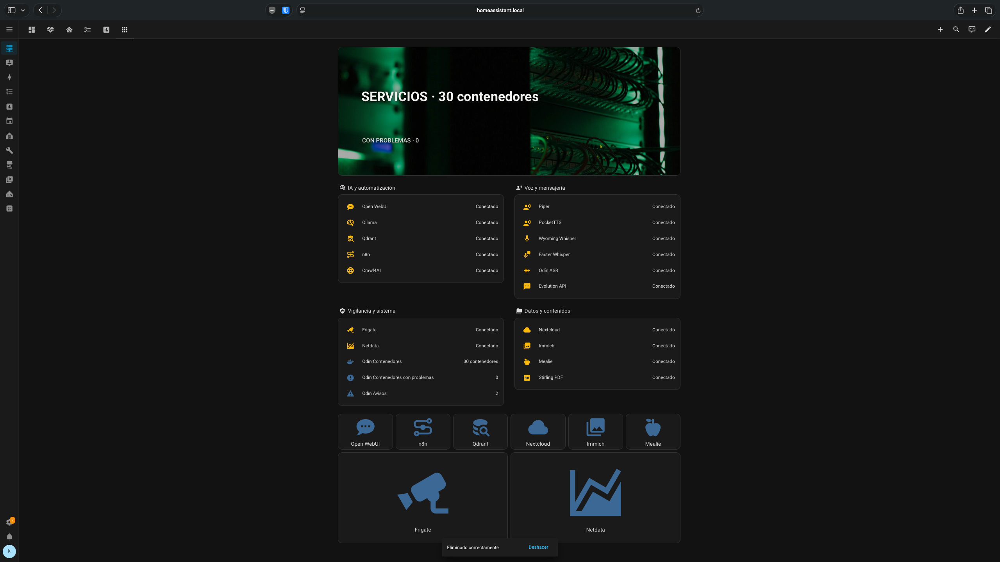 | 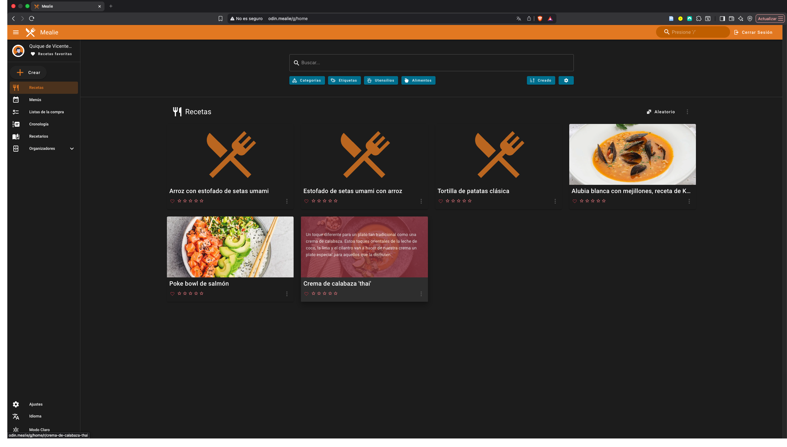 |

### Salud y operación

Odín también recoge datos de Health Connect, estado de infraestructura, métricas de Netdata, avisos proactivos y validaciones operativas.

| Salud | Monitor |
| --- | --- |
| 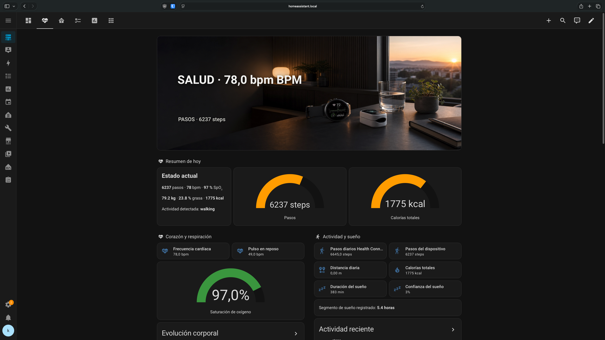 | 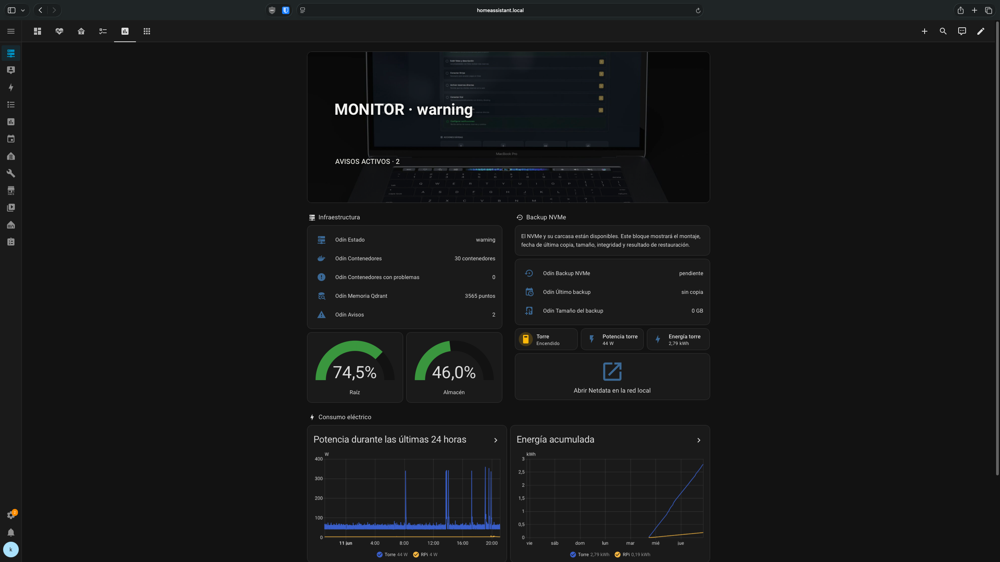 |

| Netdata | Avisos |
| --- | --- |
| 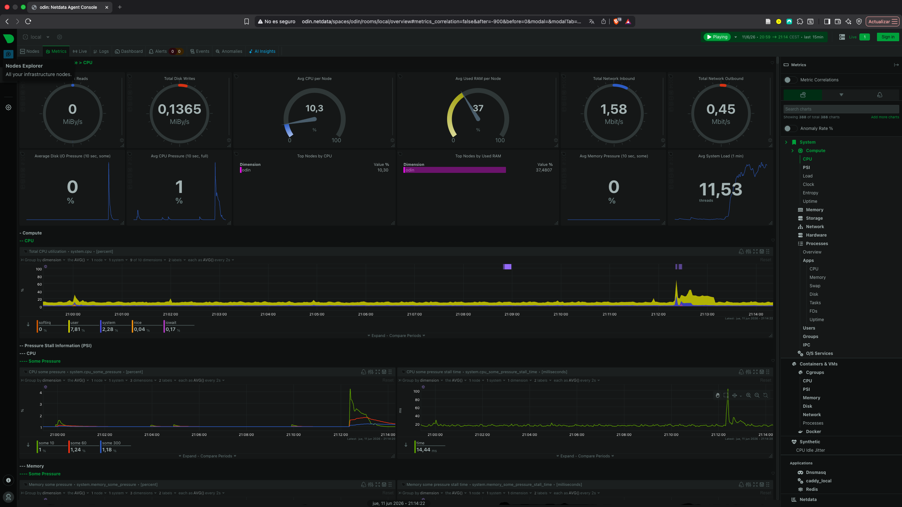 | 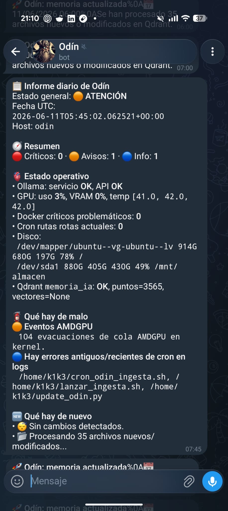 |

## Compilar

```bash
tectonic --outdir build main.tex
```

El PDF se generara en `build/main.pdf`.

## Bibliografía

Las referencias están en `references.bib`. Las fuentes web incluyen una nota con fecha de consulta editable para poder ajustarla cuando se revise la memoria.

## Estructura

- `main.tex`: configuración general y orden del documento.
- `chapters/`: portada, resumenes y capitulos principales.
- `appendices/`: anexos.
- `figures/`: imagenes y diagramas.
- `tables/`: tablas auxiliares si hacen falta.
- `server-compose/`: stacks Docker saneados.
- `server-systemd/`: unidades systemd reproducibles.
- `tools/`: scripts operativos y catálogo de tools.
- `tools/benchmark_ollama.py`: benchmark reproducible de modelos locales.
- `tools/backup_diario.sh`: backup incremental y cifrado con Restic sobre el NVMe.
- `tools/setup_backup_nvme.sh`: montaje persistente y restrictivo del NVMe.
- `server-compose/Caddyfile.local`: nombres locales de los servicios de Odín.
- `home-assistant/odin-dashboard.json`: dashboard operativo de Odín para Home Assistant.
- `home-assistant/assets/odin-dashboard-hero.png`: cabecera panorámica propia del dashboard.
- `home-assistant/assets/views/`: cabeceras específicas y atribuciones de cada vista.
- `docs/guia-replicacion-odin.md`: guía completa para desplegar una réplica.
- `docs/auditoria-informe-intermedio-final.md`: trazabilidad entre el seguimiento y la memoria final.
- `docs/benchmark-ia-voz-backup-2026-06-12.md`: resultados medidos de IA, voz y backup.

## Replicar Odín

La guía detallada está en
[`docs/guia-replicacion-odin.md`](docs/guia-replicacion-odin.md).

No se recomienda ejecutar todos los Compose directamente. La guía explica el
orden de despliegue, adaptación de rutas, creación de secretos, configuración
de hardware, importación de tools, validaciones, backup y resolución de
problemas. El repositorio no contiene credenciales ni datos personales.

## Seguridad

El repositorio público solo contiene memoria, documentación, scripts y configuraciones saneadas. Los despliegues reales deben mantener las credenciales en `.env`, publicar solo ejemplos en `.env.example` y no versionar ningún secreto.

## Estado de validación

El consumo de la torre y la Raspberry Pi ya se mide con enchufes Sonoff. Los
modelos Ollama, STT y TTS tienen un benchmark reproducible. El NVMe externo de
1 TB está montado de forma persistente en `/mnt/backup_nvme` y contiene un
repositorio Restic cifrado que cubre infraestructura, Nextcloud e Immich. La
clave de recuperación se conserva fuera del servidor.
